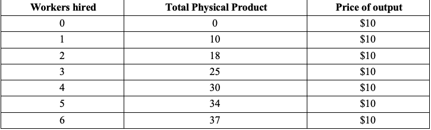

<h1>Labour Demand 1 In-Class Questions</h1>

<h2>EC306- Wages and Employment</h2>

<h2>Justin Smith</h2>

<h2>Wilfrid Laurier University</h2>

<h2>Winter 2026</h2>

{.absolute top="300" left="900" width="550"}

## BGLRS Chapter 5 Review Question 3

The firm's demand schedule for labour is a negative function of the wage because as the firm uses more labour it has to utilize poorer-quality labour, and hence pays a lower wage. True or False? Explain

## BGLRS Chapter 5 Problem 2

The provision of health services requires the labour of doctors and nurses. If the wage rate of nurses increases while the doctor's wages are unchanged, the demand for doctors will increase. True or False? Explain.

## MC1

The figure below gives the production schedule and the product demand schedule for a firm, which has to decide how many workers to hire. If the wage = \$40 for the time period in question, then the number of workers hired is:

{fig-align="center" width="576"}

A 2\
B) 3\
C) 4\
D) 5\
E) 6

## MC2

Assume that at the wage rate of \$10 per hour, a firm is hiring 100 hours of labour per week. If the wage elasticity of demand is -1.2, how many hours of labour will the firm shed if the wage increases by \$2 per hour?

A\) 5 hours per week\
B) 12 hours per week\
C) 20 hours per week\
D) 24 hours per week\
E) 36 hours per week

## MC3

The short-run demand curve slopes downward because:

A\) The labour supply curve slopes upward\
B) of the law of diminishing marginal returns to labour\
C) As employment levels increase, firms are forced to employ workers of lower quality\
D) Of the law of diminishing marginal utility\
E) Of the wage elasticity of labour demand
